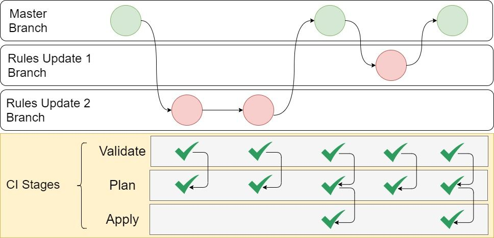

# Firewall as Code

Code example to do Firewall as Code with Azure Firewall 

## Getting started

You have to clone this repo, create a new branch, do your changes and push your branch.  
*Push from fork is not working as some GitLab variables are linked to this project.*

Example: 
```
git clone git@gitlab.com:VincentMisson/firewall-as-code.git
git checkout -b FirewallChange-CHG000001

Update the firewall-policy.tf file with your new rules

git commit -am "FirewallChange : CHG000001 - New rules"
git push origin FirewallChange-CHG000001
```

This new push will trigger the CI from validation and plan. 
From the deploy it will required to have this branch merge into main. 



